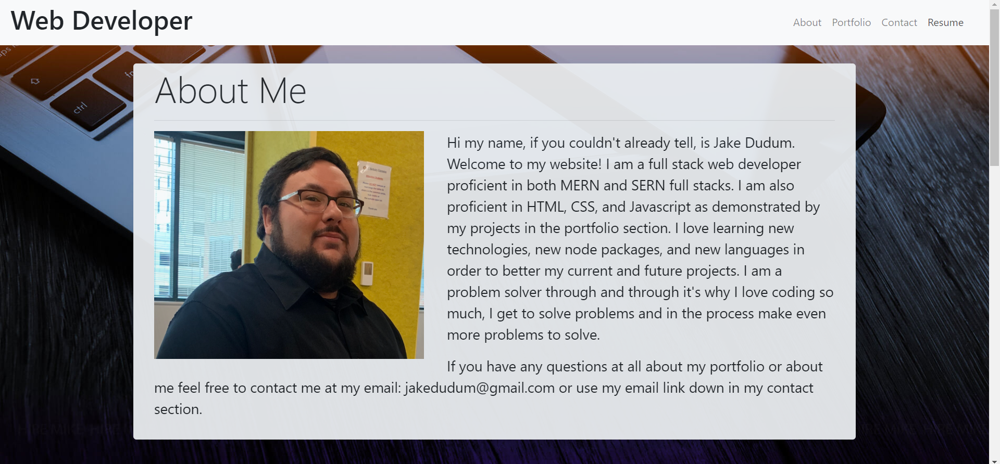

# My-Portfolio

A site with all of my noteworthy projects and my resume.

# Link to Deployed Site
- [My-Portfolio](https://jakedudum.github.io/My-Portfolio/)

# Built With
- [HTML](https://developer.mozilla.org/en-US/docs/Learn/HTML)
- [CSS](https://developer.mozilla.org/en-US/docs/Web/CSS)
- [Bootstrap](https://getbootstrap.com/)
- [Javascript](https://developer.mozilla.org/en-US/docs/Web/JavaScript)
- [Jquery](https://jquery.com/)

# Versioning
- [Github](https://github.com/)

# Authors
### Jake Dudum